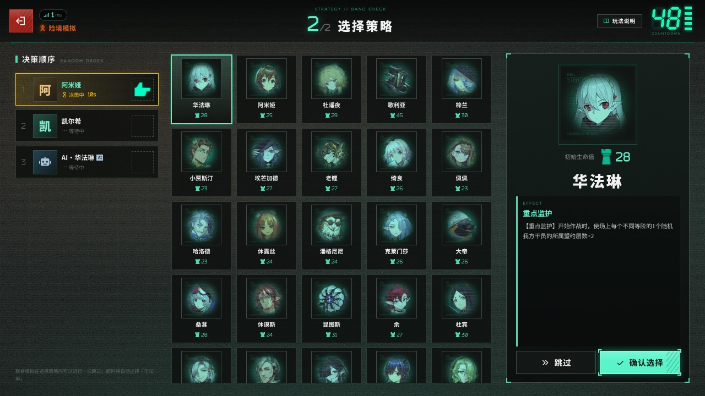

# 卫戍协议：盟约 · Stronghold Protocol: Infinity

《明日方舟》季节性自走棋塔防玩法「卫戍协议：盟约」的**非官方同人复刻**：浏览器即开即玩，单人或 1–4 人联机合作。


## 来源与版本

> [!IMPORTANT]
> **本项目是 [sganggs/Stronghold-Protocol](https://github.com/sganggs/Stronghold-Protocol) 的改版（derivative / fork），不是原作。**
>
> | | |
> |---|---|
> | **上游（原作）** | [sganggs/Stronghold-Protocol](https://github.com/sganggs/Stronghold-Protocol) — 《卫戍协议：盟约》非官方同人复刻，作者 **sganggs** 与各位贡献者 |
> | **本改版** | [Mizuki-OvO/Stronghold-Protocol-Infinity](https://github.com/Mizuki-OvO/Stronghold-Protocol-Infinity)，维护者 **Mizuki-OvO** |
> | **改版基线** | 上游 **v0.1.3**（2026-10-04） |
> | **本版** | **0.2.0-infinity.1** |
> | **许可证** | 与原作相同：**GPL-3.0-or-later**（游戏素材不在许可范围内，见 [NOTICE.md](NOTICE.md)） |
>
> **原作的功劳全部归于原作者。** 本仓库只在其基础上增加功能与修复，游戏本体的设计、实现、数据整理和规则考证都是上游作者的成果。因为原作采用 GPL-3.0，本改版必须（也乐意）以同一许可证发布，并**完整保留**原作的版权声明、[NOTICE.md](NOTICE.md)、[THIRD-PARTY-NOTICES.md](THIRD-PARTY-NOTICES.md) 与 [LICENSE](LICENSE)。
>
> 本改版**同样完全非商业**，并沿用原作的全部声明、素材限制与免责条款（见下方[声明](#声明)）。素材版权仍归鹰角网络 / Yostar 所有。
>
> 想玩原汁原味的版本、或想给游戏本体提建议，请去 **[上游仓库](https://github.com/sganggs/Stronghold-Protocol)**。

## 本改版（Infinity）新增了什么

改动集中在**玩法扩展**和**本地测试工具**两块，游戏本体的规则没有被改写。详细设计与实现见 [`数值修改器说明.md`](数值修改器说明.md) 和 [CHANGELOG.md](CHANGELOG.md)。

### 1. 无尽模式（Endless）

通关**第 15 回合「隐秘核心」**之后，会出现一次投票，问全体存活玩家是否进入无尽模式（AI 队友默认同意，30 秒不答视为放弃）。同意后进入循环：

- **6 个精英波 + 1 个领袖波 = 1 个循环（7 波）**，无限重复，回合号从第 16 波开始。
- **难度复利生长**：第 N 波的敌人属性 = 官方第 15 波 × `1.05^(N−15)` 生命 / `1.03^(N−15)` 攻击与防御。
- **领袖池合并**：从「最终攻势」和「隐秘核心」两个首领池**一起**抽取。
- **每波结算的平衡**：从无尽第 2 波起，每个存活玩家**层数最高的盟约 −15 层**（并列时随机取一个），并 **+1 点目标生命值**（无上限）。已被淘汰的玩家不受影响。
- **商店可升到 7 级**：干员与道具的刷新概率与 6 级**完全相同**（不新增品阶），额外多出 **1 个只出特殊道具的栏位**。
- **机变阶段**：每个 7 波循环里，**第 3 波结束后的下一波**开场会有一次机变选卡（官方局里机变只出现在第 3/9/11 回合，无尽模式把这个节奏延续下去）。落点是第 19、22、25、28… 回合。
- 结果页会记录打到的无尽波数。

### 2. 无尽模式的 6 件特殊道具

商店 7 级的特殊栏位只会开出这些**消耗品**（装备即销毁，加成**本局永久**）：

| 图标 | 名称 | 效果 | 售价 |
|---|---|---|---|
| ❤️ | 无尽核心 | 装备时销毁，携带者生命值 +3% | 3 |
| ⚡ | 超频芯片 | 装备时销毁，携带者攻击速度 +15 | 3 |
| 🛡️ | 壁垒发生器 | 装备时销毁，携带者防御力 +3% | 3 |
| ✨ | 奥术棱镜 | 装备时销毁，携带者法术抗性 +1 | 3 |
| ⚔️ | 猎手瞄准镜 | 装备时销毁，携带者攻击力 +3% | 3 |
| 📜 | **动员令** | 装备时销毁，**最大可部署人数变为 10** | **10** |

「动员令」是这一套的终盘件：它**只在可部署人数已经达到 9 时才会被刷出来** —— 也就是你必须先给干员装上官方道具「人事部文档」（`最大可部署人数变为9`）把上限顶到 9。上限是保底式的（只升不降），所以重复获得不会叠加到 11。

### 3. 本地数值修改器（开发/测试工具）

一套**纯本地**的实时改数值面板，用来调难度、复现 bug、试玩法，改的是运行中进程的内存覆盖层，**不动任何 `data/*.json`**：

```bat
双击  开修改器.bat              :: 游戏服 3100 + 面板 3101，并自动打开浏览器
```

面板能改：起手生命值 / 金币、商店等级上限与价目表、刷新价格、备战席、上场上限、每回合收入、每卡装备数；**敌人倍率**（按难度 × 回合编辑，或批量应用区间）；**无尽模式参数**（成长系数、削层数、回血、机变间隔）；对局中每个座位的生命 / 金币 / 商店等级 / 盟约层数；以及**回合控制**：

- **跳到指定回合** —— 在回合边界生效（下一个回合变成你填的号），下一波的出怪、难度倍率、无尽步进全部按新回合号重算；往回跳也可以。
- **跳过当前阶段** —— 立刻触发该阶段的倒计时到期。
- **自检** —— 让服务器用**游戏自己的 `GameData`** 解析一遍数值，直接证明覆盖真的进了游戏。

这套工具是**开发用途**，不会影响 `node server/index.js` 的正常启动。完整说明见 [`数值修改器说明.md`](数值修改器说明.md)。

### 4. 上游 bug 修复

- **无尽循环的领袖波（每循环第 7 波）之前完全打不了**：`prepEnded()` 只认官方的两个领袖回合，无尽领袖波落到了普通作战流程，而那一步的 `this.wave` 是 `null`（出怪在 `bossWaves` 里）—— 场上没有敌人，回合永远结算不掉，卡死。另外打完领袖后 `_finishFinal()` 会走「解锁隐秘核心」的分支，把回合号拉回第 15 回合。两处都已修。
- **特殊道具的属性加成之前完全不生效**：增益数据能一路走到战斗输入，但 `Battle._createAllyFromInput` 没有把它拷到战斗单位上；补上之后又发现 `installStatBonus` 是在单位部署**之前**跑的，`addBuff` 会拒绝未存活的单位而**静默丢弃**增益，需要 `allowDead: true`。现在 5 件属性道具都经过实测（含叠加与永久性）。
- **特殊道具在客户端没有名称和详情**：这类道具只定义在服务端代码里，而客户端的商店卡片和信息弹窗读的是 `data/items.json`，所以之前只显示一串 id、右键弹不出内容。新增 `tools/sync-endless-items.mjs` 把规格幂等地镜像进该文件，并接进了 `npm run build-data`。

## 声明

> [!IMPORTANT]
> - 本项目是玩家自制的**非官方同人作品**，与上海鹰角网络科技有限公司（Hypergryph）、Yostar 及其关联方**没有任何关系**，未获其授权或认可。
> - 《明日方舟》及「卫戍协议」相关的名称、角色、美术、音乐、音效、文本与数据等素材，版权归原权利人所有。这些素材**不适用**本项目的 GPL-3.0 许可证；GPL 只覆盖本项目自己编写的代码。
> - 仅供学习交流与个人非商业使用。**严禁任何形式的盈利**，包括但不限于：售卖本项目或整合包、付费下载或付费分发、收费服务器或收费代开、广告 / 打赏 / 会员等变现方式，以及其他任何商业用途。
> - 仓库源码不包含游戏的美术与音频素材（只有由官方数据表生成的数据和几张游戏截图，同样不适用 GPL）；[上游 Releases](https://github.com/sganggs/Stronghold-Protocol/releases/latest) 中的整合包为了方便玩家附带了素材，下载即视为同意本声明。请勿将素材用于本项目以外的用途或单独再分发。完整条款见 [NOTICE.md](NOTICE.md)。
> - 权利人如认为本项目侵犯其权益，请通过 Issue 联系，我们会**立即删除**相关内容。
> - 本项目按「现状」提供，**不提供任何担保**，使用风险自负。

English summary: [below](#english).

| 同盟房间 | 策略轮选 | 休整期（商店 / 盟约） |
|---|---|---|
|  |  |  |
| **部署方向轮盘** | **作战** | **最终攻势** |
|  |  |  |

## 目录

- [来源与版本](#来源与版本) · [本改版新增了什么](#本改版infinity新增了什么) · [声明](#声明) · [简介](#简介) · [功能一览](#功能一览)
- [快速开始](#快速开始)：[整合包](#方式一整合包推荐) · [从源码运行](#方式二从源码运行) · [系统要求](#系统要求) · [端口与配置](#端口与配置) · [局域网联机](#和朋友一起玩局域网)
- [联机方式](#联机方式) · [操作](#操作) · [文档](#文档) · [开发与测试](#开发与测试) · [项目结构](#项目结构)
- [许可证](#许可证) · [致谢与数据来源](#致谢与数据来源) · [贡献](#贡献)

## 简介

「卫戍协议：盟约」是自走棋 + 塔防：休整期在调度中心招募干员、摆阵、配装备，作战期干员自动部署，迎击从红门涌来的敌人，漏过去的敌人扣目标生命值。本项目在浏览器里复刻了这一玩法，规则和数值尽量对照官方数据表与 PRTS 核对。

- **独立模拟**（单人）与**同盟模拟**（1–4 人**合作**，没有 PvP；空位可以加 AI 队友）。
- 服务器是一个 Node.js 程序，**战斗在各玩家的浏览器里模拟**（和官方一样），服务器只管经济与回合，一台低功耗小主机就能开服。
- 当前版本 0.1.3：修复了 0.1.2 发布后玩家和 GitHub 上反馈的问题，详见 [CHANGELOG.md](CHANGELOG.md)。仍有少数规则按推断实现，与官方不一致的地方欢迎在 Issue 里反馈。

## 功能一览

- **完整的一局**：确认本局信息 → 策略轮选（40 名策略）→ 14 回合 → 结算称号；险境及以上满足条件时进入第 15 回合「隐秘核心」。
- **4 种难度**：标准 / 险境 / 绝境 / 终极，独立与同盟各一套参数，均取自官方数据。
- **休整期**：招募、刷新、冻结、升级调度中心；整备区与临时整备区；从整备区拖到棋盘部署，用**方向轮盘**选择朝向。同盟模拟的卡池共用。
- **晋升精锐**：3 名同名干员自动合成精锐，并获得一次高一阶的免费招募。
- **干员与调配**：112 名可招募干员（+ 精锐）及其技能、天赋和特质；开局前可以为每名干员选择携带的技能（283 个技能全部手工实现）和精锐的模组。
- **盟约与层数**：23 个盟约（8 个势力核心盟约 + 附加盟约），层数整局保留，每个盟约最多 999 层。
- **装备与机变**：装备与法术，同名装备合成、特定组合赋予盟约效果；已配发的装备锁定在干员身上。部分回合开始前有机变选卡（装备、资金、干员、层数、悬赏等）。
- **自动作战**：技能按官方「技能策略」自动释放；按接触半径阻挡，阻挡者倒下时由接触的干员接替；元素损伤与元素爆发；召唤物由玩家手动摆放；推开 / 拉拽按力度与重量计算；被击倒的干员留在原地显示再部署倒计时。
- **地形与敌人**：阻隔工事、射击台、源石流吹风机、沼泽、排气格栅、涨潮等地形装置；空中与近地悬浮敌人、悬赏敌人。
- **联防**：有人漏怪、又有人完美作战时，完美作战的队友带着阵容帮忙拦截漏掉的敌人。
- **最终攻势与隐秘核心**：两人共享一个战场，全队共同削减同一条领袖血条；10 个敌方领袖，巨型领袖约 5×3 格的受击范围，以及官方的限伤规则。
- **结算称号**：卫戍之星、不朽盟约、坚若磐石等 6 个称号。
- **断线重连**：同盟模拟断线后 10 分钟内重新打开页面即可回到原座位，掉线期间按原阵容自动作战，也可以「暂离」交给 AI 托管；独立模拟 24 小时内可以回来继续（同一个浏览器）。
- **交互细节**：漏怪时顶栏的目标生命值实时减少（结算时确定）；点选、拖放和配发装备都按地上的方格；购买、升级和机变选卡都需要点两次确认；只有一名玩家时除作战外不计时。
- **画面与声音**：真实 Spine 小人、官方 BGM 与音效、表情（6 套 × 6 个）、作战特效；可选的官方 3D 棋盘（需要从本机客户端提取贴图）。
- **手机与电脑**：触摸拖拽、长按查看详情，推荐横屏；设置里可以调低画质。

## 快速开始

### 方式一：整合包（推荐）

整合包里已经包含代码、运行依赖和全部美术 / 音频（含官方 3D 棋盘贴图），解压就能玩，不需要再下载任何东西。

1. **安装 Node.js 22 或 24（LTS）**
   - Windows：在 PowerShell 里运行 `winget install OpenJS.NodeJS.LTS`，或到 <https://nodejs.org/zh-cn/download> 下载安装包。
   - macOS：`brew install node@22`，或到官网下载安装包。
   - Linux：发行版的包管理器、nvm 或 fnm。
2. **下载**：在 **[上游 Releases](https://github.com/sganggs/Stronghold-Protocol/releases/latest)** 页面下载最新版本的整合包（zip），解压到一个路径较短的文件夹（Windows 上建议不要放在 OneDrive 同步的目录里）。
   > 整合包由**上游**发布，内容是原版游戏（v0.1.3），不含本改版的无尽模式与修改器。想玩本改版请用下面的「[方式二：从源码运行](#方式二从源码运行)」，把仓库地址换成本仓库即可。本仓库暂不另发整合包，以免与上游的发布混淆。
3. **启动**
   - Windows：双击 **`scripts\start-windows.bat`**。如果弹出「安全警告」，点「运行」；Windows 防火墙弹窗请勾选「专用网络」并允许。
   - macOS / Linux：在解压出的文件夹里运行 `./scripts/start.sh`（或 `bash scripts/start.sh`）。
4. 浏览器会自动打开 `http://localhost:3000`。窗口里列出的局域网地址可以直接发给同一网络的朋友。关闭窗口（或按 `Ctrl+C`）即停止服务器。

### 方式二：从源码运行

```bash
git clone https://github.com/Mizuki-OvO/Stronghold-Protocol-Infinity.git
cd Stronghold-Protocol-Infinity
npm install        # 安装依赖（postinstall 会把 pixi / preact / three 复制到 public/vendor）
npm run setup      # 检查环境，并从公开镜像下载约 270 MB 美术 / 音频（可中断，再次运行会续传）
npm start          # 启动服务器：http://localhost:3000
```

也可以直接运行启动脚本（Windows `scripts\start-windows.bat`，macOS / Linux `scripts/start.sh`）：首次会自动安装依赖、下载素材，然后启动服务器并打开浏览器。

- **本地客户端素材（可选）**：官方 3D 棋盘、部分官方界面图标（交流按钮与表情面板的边框、模组类型图标等）和灼热 / 炽焰源石虫的官方模型需要从本机的《明日方舟》PC 客户端提取（Windows 原生客户端、macOS 的 CrossOver 或 PlayCover）。`npm run setup` 检测到客户端时会询问是否提取（需要 Python 3.8+，依赖装在项目内的 `.venv-extract`，不影响系统）；之后可以用 `node tools/setup.mjs --local` 重新提取，或用 `--game "<…/StreamingAssets/AB/Windows>"` 指定路径。没有客户端时游戏照常运行，这几样换成替代样式：2D 棋盘、样式相近的图标、染色的普通源石虫。表情和「玩法说明」的教程图随上面的素材一起从公开镜像下载，不需要客户端。没有客户端的服务器（例如 Linux VPS）也可以从**同一版本**的整合包里复制 `public/assets/local/` 和 `data/local-assets.json`，见 [docs/DEPLOY.md](docs/DEPLOY.md) 的「本地客户端素材」。
- 素材下载优先使用 GitHub，失败时自动改用 jsDelivr 镜像。
- `npm run doctor`（即 `node tools/doctor.mjs`）可以随时诊断：Node 版本、素材是否完整、端口占用、局域网地址和防火墙。

### 系统要求

| 项目 | 要求 |
|---|---|
| 开服的电脑 | Windows / macOS / Linux，Node.js 22 或 24（LTS）；磁盘约 400–500 MB（素材、依赖与可选的本地提取贴图）；内存空闲约 100 MB，每局再加几 MB |
| 玩家 | 支持 WebGL 的现代浏览器（Chrome / Edge / Firefox / Safari 最新版），电脑、手机或平板（横屏） |
| 网络 | 首次进入游戏时，每位玩家要从开服的电脑下载几十 MB 素材（之后走浏览器缓存）；对局中流量很小 |

显卡较弱时可以在「设置」里调低画质，或在网址后加 `?board=2d`（强制 2D 棋盘）/ `?render=fallback`（不用 WebGL 的简化画面）。

### 端口与配置

默认监听 **TCP 3000**。换端口：启动脚本加 `--port 3001`，或设置环境变量 `PORT`。

| 环境变量 | 默认 | 说明 |
|---|---|---|
| `PORT` | `3000` | 监听端口 |
| `HOST` | `0.0.0.0` | 监听地址（`127.0.0.1` = 只允许本机，放在反向代理后面时使用） |
| `SP_COMBAT` | `client` | `client`：各玩家浏览器模拟自己的战斗（服务器负载极低）；`server`：由服务器模拟并推流 |
| `SP_VERIFY` | `off` | 服务器复算客户端上报的战斗结果：`off` / `sample`（约 1/8 抽查）/ `all`（全部复算，更耗 CPU） |
| `TRUST_PROXY` | `auto` | 是否信任 `X-Forwarded-For` 等转发头：`auto` 只信任来自本机 / 内网的代理；`1` 总是；`0` 从不 |
| `DEBUG` | 空 | 设为任意值输出详细日志 |
| `SP_NO_BROWSER` | 空 | 设为 `1` 时启动脚本不自动打开浏览器 |

设置方式：macOS / Linux `PORT=8080 npm start`；PowerShell `$env:PORT=8080; npm start`；cmd `set "PORT=8080" && npm start`。健康检查：`GET /healthz`。

### 和朋友一起玩（局域网）

1. 打开页面 → 输入昵称 → **同盟模拟** → 创建房间。房主选择难度，可以添加 / 移除 AI 队友；开始前也可以把其他博士移出房间（对方可凭密钥重新加入）。
2. 把 4 位字母的**同盟密钥**，或「复制链接」得到的 `http://<地址>:3000/?room=密钥` 发给朋友。
3. 所有人点「准备就绪」后房主开始。
4. 同一 Wi-Fi / 路由器下的朋友打开启动窗口里列出的地址（形如 `http://192.168.x.x:3000`）即可。打不开时多半是防火墙：Windows 首次启动时在弹窗中允许「专用网络」，或运行 `npm run doctor` 查看具体命令；访客 Wi-Fi 常开启「AP 隔离」，也会导致连不上。

刷新页面或断线后，同盟模拟 10 分钟内、独立模拟 24 小时内重新打开即可回到原座位。服务器把房间和对局都保存在内存里，**重启服务器会结束所有对局**。

## 联机方式

朋友不在同一个局域网时，下面是几类常见做法，按自己的情况选一种即可。这里只做简单介绍，提到的工具和服务只是举例，本项目与它们没有任何关系，也不做推荐；具体的安装、费用和使用规则请以各自的官方说明为准。部署细节（防火墙、开机自启、反向代理与 HTTPS、Docker）见 **[docs/DEPLOY.md](docs/DEPLOY.md)**。

| 方式 | 怎么做 | 适合 |
|---|---|---|
| **同一局域网直连** | 把启动窗口里的局域网地址发给朋友 | 同一个家、宿舍或网吧 |
| **组网工具（虚拟局域网）** | 例如 Tailscale、ZeroTier、EasyTier、蒲公英：开服的人和朋友都安装同一个工具并加入同一个网络，朋友用开服电脑的虚拟 IP 访问 `http://<虚拟 IP>:3000` | 固定的几个熟人；不暴露到公网。朋友也要装客户端，部分工具需要注册账号；跨地区时可能走中继而变慢 |
| **内网穿透 / 隧道** | 只有开服的人运行客户端，朋友直接打开网址。例如自建的 frp（需要一台有公网 IP 的服务器）、Cloudflare 的 `cloudflared tunnel --url http://localhost:3000`（临时地址，每次启动都会变；国内访问延迟可能较高）、国内的樱花 frp 一类公共穿透服务（通常需要实名，大陆节点承载网页可能有备案要求） | 不想改路由器、没有公网 IP；免费线路带宽小时，首次加载素材会慢一些 |
| **云服务器 / VPS 直接部署** | 在 VPS 上运行整合包，或用仓库自带的 `Dockerfile`；用 Caddy / Nginx 加上 HTTPS。选离玩家近、线路好的地区（面向大陆玩家时，境外机房要关注回程线路，否则晚高峰延迟可能很高；大陆服务器绑定域名需要 ICP 备案） | 想长期开服、玩家分布在不同地区 |

通用注意事项：

- 游戏是**单个常驻 Node.js 进程 + WebSocket**（路径 `/ws`），只能跑一个实例，必须部署在域名根路径；Vercel 之类的 Serverless 平台和 GitHub Pages 之类的静态托管都不适用。反向代理要转发 WebSocket 升级。
- 游戏没有账号系统，**知道地址的人都能进来**。请只把地址发给朋友，不要公开发布，也不要搭建公开大厅；这同时能降低素材版权方面的风险。
- 有公网 IPv4 时也可以在路由器上做端口转发，但这会把家里的电脑直接暴露在公网上，优先考虑上面的方式。

## 操作

| 操作 | 方法 |
|---|---|
| 购买 / 升级调度中心 / 机变选卡 | 点一次选中，再点一次确认（`D` 升级） |
| 部署 / 移动干员 | 从整备区拖到棋盘格 → 出现方向轮盘 → 往上 / 右 / 下 / 左滑动选择朝向后松手；松在中心或点「✕ 点击取消」取消。拖动时模型在指针 / 手指下，指针所在的格子就是落点 |
| 调整朝向 | 把干员拖回它自己的格子，再选方向 |
| 出售 / 撤退 / 销毁装备 | 点击单位所在的格子 → 底部按钮「出售 +1」「撤退」；也可以把棋盘上的干员拖回整备区撤退。整备区里的装备与法术只能「销毁」，已配发的装备锁定在干员身上（干员出售或合成精锐时退回整备区） |
| 装备 | 把装备拖到干员所在的格子上（每人 2 件；满了会弹出替换窗口，被替换的一件会被销毁）；法术拖到地块上并选方向 |
| 查看详情 | 右键或长按单位 / 卡牌（属性为实时数值，高于基础值为绿色、低于为红色） |
| 快捷键 | `R` 刷新 · `F` 冻结 · `D` 升级 · `Space` 准备就绪 · `Esc` 取消 / 关闭 |
| 方向轮盘键盘操作 | 方向键预览 · `Enter` 确认 · `Esc` 取消 |
| 暂停（独立模拟） | 作战中（含最终攻势 / 隐秘核心）点顶栏的「暂停」或按 `Space`，再点「继续作战」（或 `Space`）继续；同盟模拟的作战不能暂停 |
| 表情 | 左下角「交流」，左右滑动（或方向键）换主题，冷却 1 秒 |
| 观战 | 自己的作战结束后（或休整期）点左侧队友头像 →「前往查看」；不参战的朋友可以在大厅输入同盟密钥点「观战」（每个同盟最多 2 名观战者，本作新增） |

完整的规则、数值和小技巧见 **[docs/PLAYING.md](docs/PLAYING.md)**（游戏内左下角也有「玩法说明」）。

## 文档

| 文档 | 内容 |
|---|---|
| [CHANGELOG.md](CHANGELOG.md) | 更新记录：每个版本修复了什么、哪些反馈经核实不是问题 |
| [docs/PLAYING.md](docs/PLAYING.md) | 玩法指南：流程、经济、招募与晋升、摆阵、联防、盟约、最终攻势、结算称号 |
| [docs/DEPLOY.md](docs/DEPLOY.md) | 部署指南：Windows 开服与开机自启、防火墙、组网 / 隧道、反向代理与 HTTPS、Docker、systemd、排错 |
| [docs/WINDOWS.md](docs/WINDOWS.md) | Windows 便携包：怎么打一份「零安装」包（`scripts/make-windows-bundle.mjs`）、包里放了什么、授权注意事项 |
| [docs/DESIGN.md](docs/DESIGN.md) | 架构与契约（英文）：技术栈、目录分工、网络协议、渲染与 UI、各次试玩后的规则修订 |
| [docs/SIM.md](docs/SIM.md) | 战斗模拟引擎参考（英文）：钩子、技能描述格式、职业默认行为 |
| [docs/META.md](docs/META.md) | 对局与经济引擎（英文）：回合流程、商店、联防、最终攻势的实现细节 |
| [docs/DATA.md](docs/DATA.md) | 由官方数据表生成的游戏数据（英文） |
| [docs/ASSETS.md](docs/ASSETS.md) | 素材来源、目录结构与清单（英文） |
| [docs/BALANCE.md](docs/BALANCE.md) | 难度模型与测量（英文） |
| [docs/research/](docs/research/00-INDEX.md) | 官方规则、数据与界面的调研记录 |

## 开发与测试

```bash
npm run dev                 # node --watch：改动服务器代码后自动重启
node --test                 # 单元 + 集成测试（约 3170 项；缺少素材 / 浏览器的用例会自动跳过）
SP_E2E=1 node --test test/ui/mock.e2e.test.js        # 浏览器端到端测试，需要本机 Chrome（CHROME_PATH 可指定路径）
SP_REAL_E2E=1 node --test test/ui/real.e2e.test.js   # 需要 Chrome + 已下载的素材
RENDER_E2E=1 node --test 'test/render/*.browser.test.js'   # 渲染测试，部分需要本地提取的棋盘贴图
```

- 游戏数据由 `npm run build-data`（`tools/build-data.mjs`）从官方数据表生成，不要手工修改 `data/*.json`。
- GitHub Actions（[.github/workflows/ci.yml](.github/workflows/ci.yml)）在 Ubuntu 与 Windows、Node 22 / 24 上运行 `npm ci`、`node --test` 和服务器冒烟测试。

## 项目结构

| 路径 | 内容 |
|---|---|
| `server/` | Node HTTP 静态服务 + WebSocket（`/ws`）、大厅、对局引擎（`match/`）、战斗模拟（`sim/`，浏览器与服务器共用） |
| `shared/` | 前后端共用的常量与网络协议 |
| `public/` | 浏览器客户端（原生 ES 模块，PixiJS + pixi-spine、three.js 3D 棋盘、Preact + htm UI） |
| `data/` | 由官方数据表生成的游戏数据与素材清单 `assets.json` |
| `tools/` | `setup.mjs` / `doctor.mjs`、素材下载 `fetch-assets.mjs`、数据构建、本地提取 `local-extract/` |
| `scripts/` | 启动脚本（Windows / macOS / Linux）、Windows 开机自启 |
| `docs/` | 文档与调研 |
| `test/` | `node:test` 测试 |

## 许可证

- **代码**：本项目自己编写的代码以 **GPL-3.0-or-later** 发布，全文见 [LICENSE](LICENSE)；另附一条 GPL 第 7 条的附加许可，允许与 pixi-spine 中的 Spine Runtimes 组合分发（见 [NOTICE.md](NOTICE.md)）。
  本改版（Infinity）**沿用上游相同的许可证**，并保留上游全部的版权声明与声明文件 —— 这是 GPL 的要求，也是应该的。
- **游戏素材不在许可范围内**：《明日方舟》相关的美术、音乐、音效、文本与数据等版权归原权利人所有，不适用 GPL，使用限制见上方的[声明](#声明)和 [NOTICE.md](NOTICE.md)。
- **第三方组件**各自遵循其许可证：通过 npm 安装的库（整合包的 `node_modules` 中附带各自的许可证文件）、`tools/local-extract/aklz4.py` 的算法（BSD-3-Clause），以及字体等，清单与许可证全文见 [THIRD-PARTY-NOTICES.md](THIRD-PARTY-NOTICES.md)。

## 致谢与数据来源

- **本项目（Infinity 改版）的全部基础来自上游 [sganggs/Stronghold-Protocol](https://github.com/sganggs/Stronghold-Protocol)**：游戏本体、规则实现、数据管线、文档与测试框架均为上游作者与贡献者的成果。本改版只在其上追加了无尽模式、特殊道具、数值修改器与若干修复。请优先给上游点 Star。
- 游戏数据：[Kengxxiao/ArknightsGameData](https://github.com/Kengxxiao/ArknightsGameData)。
- 素材来源：[yuanyan3060/ArknightsGameResource](https://github.com/yuanyan3060/ArknightsGameResource)、[fexli/ArknightsResource](https://github.com/fexli/ArknightsResource)、[isHarryh/Ark-Models](https://github.com/isHarryh/Ark-Models)、[ArknightsAssets/ArknightsAssets2](https://github.com/ArknightsAssets/ArknightsAssets2)；字体来自 [TimWangZi/The-font-of-Arknights](https://github.com/TimWangZi/The-font-of-Arknights) 与 Google Fonts（Noto Sans SC）。详见 [docs/ASSETS.md](docs/ASSETS.md)。
- 规则核对参考：[PRTS 明日方舟中文 Wiki](https://prts.wiki/)。
- LZ4AK 解包：`tools/local-extract/aklz4.py` 的算法来自 [isHarryh/Ark-Unpacker](https://github.com/isHarryh/Ark-Unpacker)（BSD-3-Clause，经 MooncellWiki/UnityPy）；解析 Unity 资源使用 [UnityPy](https://github.com/K0lb3/UnityPy)（MIT）。
- 库：[PixiJS](https://pixijs.com/)（MIT）、[pixi-spine](https://github.com/pixijs/spine)（MIT；其中包含的 Spine Runtime 另受 [Spine Runtimes License](https://esotericsoftware.com/spine-runtimes-license) 约束）、[three.js](https://threejs.org/)（MIT）、[Preact](https://preactjs.com/) + [htm](https://github.com/developit/htm)（MIT）、[ws](https://github.com/websockets/ws)（MIT）。

感谢以上项目的作者与维护者，以及鹰角网络带来的这款游戏。

## 贡献

欢迎提 Issue 反馈 bug、与官方规则不一致的地方或改进建议，也欢迎提交 Pull Request：

- 提交前请运行 `node --test`，并同步更新相关文档；文档使用简体中文，代码与注释使用英文。
- 提交的代码将以 GPL-3.0-or-later 发布。
- 请不要提交任何游戏素材文件（`public/assets/` 等目录已被 `.gitignore` 排除）。
- 本项目坚持非商业：请不要提交广告、付费、打赏等任何形式的变现功能。

---

## English

**Stronghold-Protocol-Infinity** is a modified fork of [sganggs/Stronghold-Protocol](https://github.com/sganggs/Stronghold-Protocol), itself an **unofficial, non-commercial fan remake** of Arknights' seasonal auto-chess tower-defense mode *Stronghold Protocol: Alliance*, played in the browser: solo, or 1–4 player co-op (AI teammates can fill seats). Combat is simulated in each player's browser, so a low-power PC can host.

- **Provenance:** forked from upstream **v0.1.3**; this fork is **0.2.0-infinity.1**, maintained by [Mizuki-OvO](https://github.com/Mizuki-OvO). All credit for the game itself belongs to the upstream author and contributors. Licensed under the same **GPL-3.0-or-later**, with the upstream copyright notices and NOTICE files kept intact. Please use the **[upstream repository](https://github.com/sganggs/Stronghold-Protocol)** for the original game.
- **What this fork adds:** an **endless mode** (a vote after clearing the Hidden Core; 6 elite waves + 1 boss per cycle, compounding enemy stats, a merged boss pool, a per-wave bond-layer/LP trade, a level-7 shop with one special-item slot, and a 机变 draft every cycle), **6 endless consumable items** (five permanent stat bonuses plus 动员令, which raises the deploy cap to 10 and only appears once the cap is already 9), a **local number modifier** for testing (`开修改器.bat` — a web panel that live-edits a running match without touching `data/*.json`), and fixes for three upstream bugs (the endless cycle boss being unplayable, the special items' stat bonuses never reaching combat, and the special items having no client-side name or tooltip).
- **Run:** download the all-in-one bundle from the [upstream Releases](https://github.com/sganggs/Stronghold-Protocol/releases/latest) (upstream bundle = the original game; build this fork from source), install Node.js 22 or 24, then double-click `scripts\start-windows.bat` (Windows) or run `./scripts/start.sh` (macOS / Linux) and open <http://localhost:3000>. From source: `npm install && npm run setup && npm start` (setup downloads ~270 MB of art from public mirrors, the emotes and the how-to-play pages included; the official 3D board, some official HUD icons and two enemy models are extracted from a local Arknights client — without one the game uses the 2D board and look-alike stand-ins, and a server can copy `public/assets/local/` and `data/local-assets.json` from the release bundle of the same version).
- **Play with friends:** create a co-op room and share the 4-letter key or the `?room=KEY` link. On a LAN, use the address printed at start; otherwise use a virtual-LAN tool, a tunnel or a VPS — see [docs/DEPLOY.md](docs/DEPLOY.md).
- **Disclaimer:** not affiliated with or endorsed by Hypergryph or Yostar. All Arknights names, art, audio, text and data are © their respective owners and are **not** covered by this project's GPL licence. For study and personal non-commercial use only — no selling, paid distribution, paid servers or monetisation of any kind. Content will be removed on request of the rights holders. Provided "as is", without warranty.
- **License:** code GPL-3.0-or-later ([LICENSE](LICENSE)); game assets excluded.
